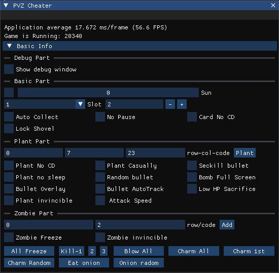

# PVZ Cheater

[TOC]

## 0x0. Introduce

This is a Plant vs. Zombie cheater.




Demo:


## 0x1. Game Basis

base = [PlantsVsZombies.exe+329670]

base868 = [ base + 868 ]

### 1. Base Related

| Name | Offset | Size | Desc |
| ---- | ------ | ---- | ---- |
|      |        |      |      |
|      |        |      |      |
|      |        |      |      |
|      |        |      |      |


### 2. Base868 Related

| Name           | Offset(base868+??) |                                                             |
| -------------- | ------------------ | ----------------------------------------------------------- |
| ZombieRelative | 0xA8               | ZbArr, arrLen, MaxAllowZbCount, livedZbCnt                  |
| PlantRelative  | 0xC4               | PltArr, arrLen, MaxAllowPltCount, livedPlantCnt             |
| BulletRelative | 0xE0               | BltArr, arrLen, MaxAllowBltCount, livedBltCnt               |
| DropObjCount   | 0x10C              | The Count of dropped objects(Sun, Coin)                     |
| Scene          | 0x5564             | 0->fore_day 1->fore_night 2->backyard-day 3->backyard-night |
|                | 0x5568             |                                                             |
| SunCount       | 0x5578             | The count of sun                                            |

## 0x2. Sun Related

Functions:

| Name        | Function Address | Op Address | Param                  | Return Value |
| ----------- | ---------------- | ---------- | ---------------------- | ------------ |
| AddSunCount | 0x41E6E0         | 0x41E6E0   | (base868, count)       | -            |
| DecSunCount | 0x41E830         | 0x41E846   | (-, decCount, base868) | bool         |
|             |                  |            |                        |              |
|             |                  |            |                        |              |

### 1. AddSunCount

```c++
int __usercall addSunCount@<eax>(int result@<eax>, int a2@<ecx>)
{
  int v2; // ecx
  char v3[4]; // [esp+4h] [ebp-8h] BYREF
  int v4; // [esp+8h] [ebp-4h]

  base868->sunCount += a2;
  if ( base868->sunCount > 9990 )              // Sun count maximum limitation: 9990
    base868->sunCount = 9990;
  if ( base868->sunCount >= 8000 )
  {
    result = *(result + 0xA4);
    v2 = *(result + 0x94C);
    v3[0] = 1;
    v4 = 12;
    if ( v2 )
    {
      if ( !*(v2 + 48) )
        return sub_459670(result, v3);
    }
  }
  return result;
}
```

### 2. DecSunCount

```c++
char __usercall decSunCount@<al>(int a1@<ecx>, int decCount@<ebx>, int base868@<edi>)
{
  int preSunCount; // esi

  preSunCount = base868->sunCount;
  if ( decCount > preSunCount + (sub_41E750)(a1, base868) )
  {
    (*(**(base868 + 0xA4) + 216))(*(base868 + 0xA4), dword_727310);
    *(base868 + 0x5590) = 70;
    return 0;
  }
  else
  {
    base868->sunCount = preSunCount - decCount;// decrease sunCount
    return 1;
  }
}
```

紫卡判断是否可用关键 call：0040FDE0

## 0x3. Plant Related

### 1. Plant Info

* Plant Structure

  size: 0x14C

  | Name(offset)         | Type  | desc                                                         |      |
  | -------------------- | ----- | ------------------------------------------------------------ | ---- |
  | base(+0)             | void* |                                                              |      |
  | base868(+4)          | void* |                                                              |      |
  | XPos(+8)             | int   |                                                              |      |
  | YPos(+C)             | int   |                                                              |      |
  | XWidth(+10)          | int   |                                                              |      |
  | YWidth(+14)          | int   |                                                              |      |
  | isVisible            | byte  |                                                              |      |
  | row(+1C)             | int   | The row index                                                |      |
  | plantCode(+24)       | int   | Plant Type                                                   |      |
  | col(+28)             | int   | The col index                                                |      |
  | CurHP(+40)           | int   |                                                              |      |
  | FullHP(+44)          | int   |                                                              |      |
  | IsAttackType(+48)    | int   | true if plant can emit seed.                                 |      |
  | BombCD(+50)          | int   | atom, ice, squash, cherrybomb                                |      |
  | ReloadCD(+54)        | int   | potato, chomper, magnet, corn cannon                         |      |
  | CurCD(+58)           | int   |                                                              |      |
  | FullCD(+5C)          | int   |                                                              |      |
  | Row(+88)             | int   |                                                              |      |
  | EmitCD(+90)          | int   | Emit interval                                                |      |
  | UniqueID(+94)        | int   | plant unique ID, if two plants has same id, then shovel hover will lighten them simontaneounsly(src: 0x467399) |      |
  | isDead(+141)         | byte  | 1 -> dead                                                    |      |
  | isDead_2(+142)       | byte  | 1 -> dead                                                    |      |
  | isDiableAttack(+143) | byte  | 1 -> not attack                                              |      |
  | -(+148)              | int   | (thisAttr & 0xFFFF0000) == 0 means dead if true              |      |

* Plant Array

  PlantRelative = [base868 + 0xC4]

  | Name               | Offset | Size | desc                      |
  | ------------------ | ------ | ---- | ------------------------- |
  | ArrPointer         | +0     | int* |                           |
  | ArrLen             | +4     | int  | the length of plant array |
  | MaxAllowPlantCount | +8     | int  | 1024                      |
  | LivedPlantCnt      | +10    | int  | Current Living Plant      |

* 


add plant count: 00420C37

是否可以随意种植判断：004127EF

冰冻菇：1045F0C6

植物技能函数：0046A110

* 原子菇：eax = F

植物定时：

* 阳光：00466E03
* 射手：00466E10

### 2. Plant Action

There have many types of CD.

| Name     | Offset(based on plantAddr) | type | desc                                     |
| -------- | -------------------------- | ---- | ---------------------------------------- |
| ReloadCD | +54                        | int  | 食人花，土豆雷，地刺，玉米加农炮，磁铁石 |
| CurCD    | +58                        | int  | 向日葵                                   |
| FullCD   | +5C                        | int  | 向日葵总CD                               |
| EmitCD   | +90                        | int  | 发射倒计时CD                             |

Plant attack process:

```c++
// 0x466B70
int plantAction(Plant p){
    if (p->alive) {
        checkAndPerformAttack(p);	// // 0x468270
        p->plantReloadCD > 0 ?  p->plantReloadCD-- : 0;
        if (isBallingGameType()) sub_4666E0();
        // 各种植物技能
        
        // 窝瓜  原子菇 冰冻菇 
        
        // 技能类植物扣减CD
        decCD(p);
        if(p->bombCD>0)p->bombCD--;
        if (p->bombCD == 1) 
    }
}
```


```c++
// 0x468270
int checkAndPerformAttack(Plant p) {
    if(p->alive) {
        if (!p->emitCD) return;
        p->emitCD--;
        if (p->code == 大喷菇 && p->emitCD==15) bulletPlantAttackOnce(p, 0, p->row, 0);
        else if (p->code == 机枪射手 && p->emitCD in [18, 35, 51, 68]) bulletPlantAttackOnce(p, 0, p->row, 0);
        else if (p->code == 猫草 && p->emitCD == 19) {
            Zombie z = plantScanGetFirstZombieByRow(0, p, p->row);
            if (z)  bulletPlantAttackOnce(p, z, p->row, 0);
        } else {
            if (p->emitCD == 1) {
                if (p->code == 三豌豆) {
                    bulletPlantAttackOnce(p, 0, p->row + 1, 0);
                    bulletPlantAttackOnce(p, 0, p->row, 0);
                    bulletPlantAttackOnce(p, 0, p->row - 1, 0);
                } else if(p->code == 前后射手) {
                    bulletPlantAttackOnce(p, 0.0, p->row, 0);
                } else {
                    if (p->code not in [32, 34, 39, 44]) { // 非投手
                        bulletPlantAttackOnce(p, 0,  p->row, 10)
                    } else {
                        // 投手
                        Zombie z = plantScanGetFirstZombieByRow(0, p, p->row);
            			if (z)  bulletPlantAttackOnce(p, z, p->row, 0);
                    }
                }
            }
        }
        
    }
}
```


```c++
int bulletPlantAttackOnce(Plant p, Zombie z, int row, int randomNumber) {
    switch ( p->code )
    {
        case 大喷菇:                                    // 
            plantCode_1 = sub_462630(plantAddr, 2);
            if ( !*(_BYTE *)(*(_DWORD *)tmpPlantAddr + 0x9E5) )
                return sub_51F6F0(*(float *)&a2);
            return plantCode_1;
        case 大大喷菇:                                    // 
            return sub_462630(plantAddr, 2);
        case star:                                    // 
            return starFruitAttack(plantAddr);
    }
    // 根据植物设置子弹类型
    if ( plantCode == 34 && randomNumber == 1 )   // 玉米射出黄油
    	bulletCode = 12;
    
    // 设置子弹起始坐标
    
    // 生成子弹
    spawnBullet(bltXPos, bltYPos, p->0x20-1, row, bulletCode);
}
```


## 0x4. Zombie

Add Zombie: 00420B87

Zombie Walk: 0053B443

Zombie Array Gap: 0x168

Zombie Count decrese / add : 41E9E6

Zombie Structure:

* +8: XPos(int)	+2C (float)
* +C: YPos(int)   +30(float)
* +34：减速速度，为负数可以击退僵尸
* +B8:是否魅惑
* +b9: 是否被吹
* +C8: 当前血量
* +CC：总血量
* +D0: 当前护盾值
* +D4: 总护盾值

Zombie blood decrease: 

* 扣减血量: 00541CDA，00541CE4
* 扣减护盾值：005419FA

Zombie Pos:

* blow: 0053B68D， label bollonzombie: 0046A07D

### 4. 是否暂停游戏

0061607F

## 5. Bullet

Change Bullet Position: 471F70

Spawn Bullet: 00470E38

子弹运动类型：

```c++
// 462440
//  *(_DWORD *)(bulletAddr + 0x74) = getPlantAttackType(plantAddr, 0);
int __userpurge getPlantAttackType@<eax>(int plantAddr@<eax>, int a2)
{
  int plantCode; // eax

  plantCode = *(_DWORD *)(plantAddr + 0x24);
  switch ( plantCode )
  {
    case 26:                                    // 仙人掌
      return (a2 != 1) + 1;                     // 01 or 10
    case 2:                                     // 爆炸类
    case 20:
    case 47:
    case 15:
      return 0x7F;
    case 39:                                    // 投手类
    case 32:
    case 34:
    case 44:
      return 0xD;                               // 1101
    case 4:
      return 0x4D;
    case 17:                                    // 南瓜
      return 0xD;
    case 8:                                     // 蘑菇类
    case 24:
    case 10:
    case 42:
    case 6:
      return 9;                                 // 1001
    case 43:                                    // 自动指向类
      return 0xB;                               // 1011
    case 19:                                    // 海草
      return 5;                                 // 0101
  }
  return plantCode != 50 ? 1 : 0x11;
}
```


### 6. 掉落物：

0041EB4F：减少掉落物数量

00420DF9：增加掉落物数量

[[base868]+10C] = 掉落物数量

## 0x2 函数

### 1. 遍历僵尸

函数：41F6B0，找到下一个僵尸

## 0x??. Reference

* https://plantsvszombies.fandom.com/wiki/Hacking_guide#Method_1